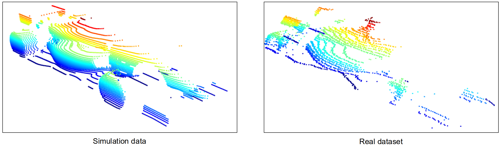
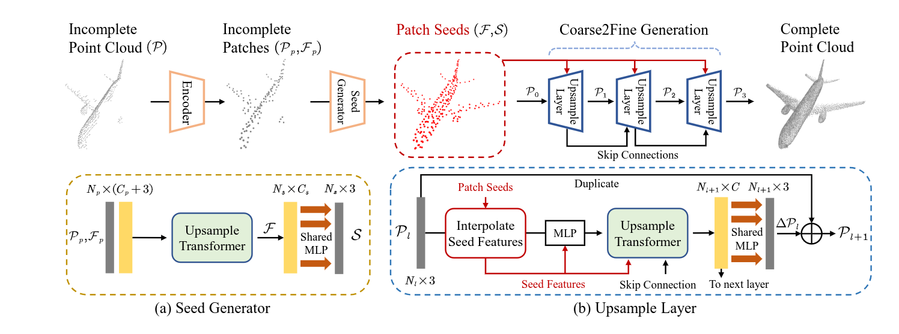

# 3D-Object Detection Optimization using Sim-to-Real Adaptation for Point Clouds with Neural Networks Overview

This repository contains the code and documentation for my master thesis titled "3D-Object Detection Optimization using Sim-to-Real Adaptation for Point Clouds with Neural Networks." The primary goal of this research was to minimize the domain gap between simulated and real-world 3D LiDAR data to optimize the performance of neural network-based 3D object detectors.

For this thesis the [Sim-to-Real Distribution-Aligned Dataset (S2R-DAD)](https://github.com/TUMFTM/Sim2RealDistributionAlignedDataset) is used. The real dataset was obtained during the Indy Autonomous Challenge in Las Vegas in 2022. The simulation dataset is distribution-aligned and mirrors the real dataset in terms of scenarios. It was generated using Unity along with a custom LiDAR sensor model. The simulated environment replicates the same racetrack found in the real-world data. Scenarios from the real dataset were recreated in this simulated setting, and point clouds were collected using the custom LiDAR sensor. Labels for the data were automatically generated within Unity.For more information please see the [repository](https://github.com/TUMFTM/Sim2RealDistributionAlignedDataset)

After extensive research the choice of network for this task was [SeedFormer](https://arxiv.org/abs/2207.10315).The network archtiecture was adjusted for the dataset and the goal of the thesis. Different kinds of PointNet architecturs are implemented and tested for best performance.

The results and reductions of domain gap is evaluated with 3D object detectors. For this [OpenPcDet](https://github.com/open-mmlab/OpenPCDet) is utilized. [PointPillars](https://arxiv.org/abs/1812.05784) and [PointRCNN](https://github.com/sshaoshuai/PointRCNN) networks from this repository are implemented with minor adjustments.

The quantitative results are listed below. PointRCNN detection results are superior to the results of PointsPillars network. This can be explained with the high sparsity of the point clouds in the dataset. These networks are trained with real,sim and adapted datasets but evaluated only with the validation set from real data. Nevertheless, with both networks it can be seen that the domain gap between real and simulated data is reduced in the best case by 1%.  For more information on the implementation and evaluation, please see the masther thesis.

Running the Code Locally
To run this project locally, follow these steps:

Clone the repository:

bash
Code kopieren
git clone https://github.com/yourusername/thesis-repo.git
cd thesis-repo
Create a virtual environment (optional but recommended):

bash
Code kopieren
python3 -m venv env
Activate the virtual environment:

On Windows:
bash
Code kopieren
.\env\Scripts\activate
On macOS/Linux:
bash
Code kopieren
source env/bin/activate
Install the required libraries:

bash
Code kopieren
pip install -r requirements.txt
Run the code: Now you can run the scripts provided in this repository as described in the Usage section.